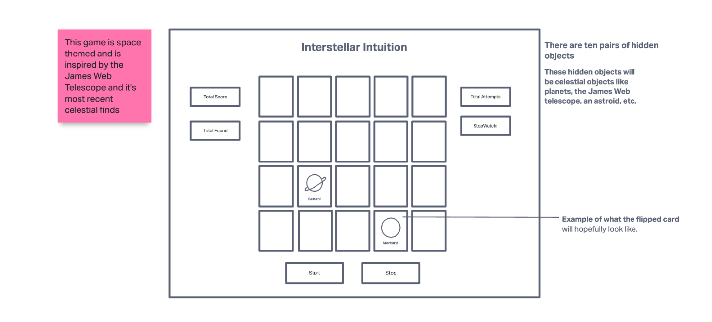
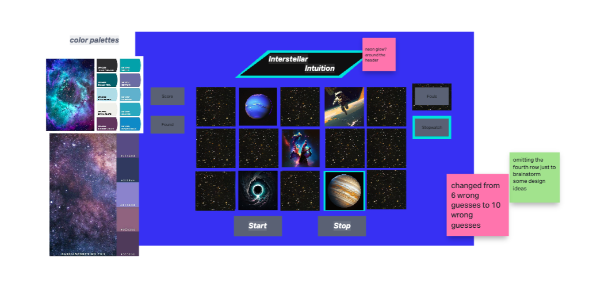
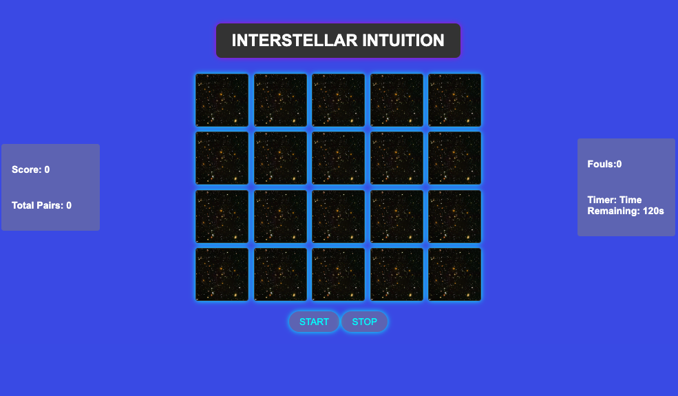
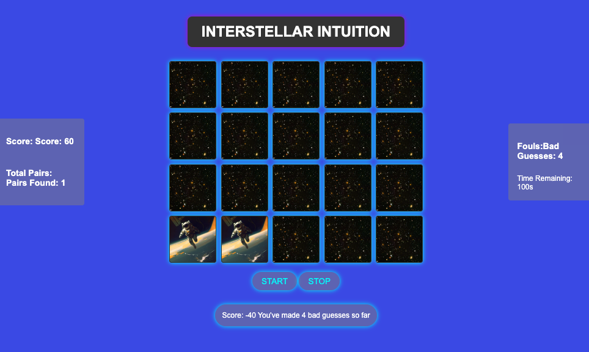

# Interstellar-Intuition-

#Intro

Hello and welcome to the details of my first browser game "Interstellar Intuition"!

I decided to base my game off the classic memory card matching game that many of you may have already played before, this is a standard single player game where the objective of the player is to reveal all 10 pairs before the time runs out.

##About the Project

Before getting into specifics I wanted to take a moment to review how I started to envision my gameplay, below you will see the super basic wireframe of what I wanted my came to look like and then ideally how I wanted to style it.

My game is space themed because I was recently inspired by some of the new photos captured by the James Web Telescope, I really wanted to lean into a cooler color pallete for the game. Now, getting into a bit of the game logic. There are a total of 20 masked cards, the player needs to click to reveal two cards at a time to recover the images.

######This project uses Javascript, HTML, and CSS!

1. The player will receive 100 points for each match pair and they can keep track of the amount of pairs they have at the side.

2. For each pair of bag guesses the player will lose 10 points from their total score and get a notification at the bottom, they can also keep track of how many bad guesses they have on the left hand game stats. 
3. The player has 2 minutes to find all ten pairs to win the game! If you run out of time or if you make 15 consecutive wrong moves you will also lose the Game.

###Psuedo-Code at a Glance!

1. Player clicks the start button to initialize the game.
2. The board begins with all of the tiles flipped down to hide the images
3. There is an array created of 20 cards with a total of ten matching pairs of images
4. Initialize variables for the player’s score, the # of matched pairs, the # of incorrect guesses and one to indicate if a  card is currently flipped over
5. Loop until all of the cards have been matched or if the player has made 6 consecutive incorrect guesses
6. Allow the player to select two cards to flip over to reveal the image
7. If the pair matches, leave the pair face up and add 100 points to the player’s score
8. If the cards do not match, flip them back over and count it as a bad guess
9. Display a notification to the player, deduct ten points from the score and add to the total amount of bad guesses
10. Win Logic: If all the cards have been matched (10 pairs total) and reveals all 20 cards, display a message to the player
11. they have won and their final score
12. Use variable to keep track of the number of matched cards
13. If the player has made 6 bad guesses, display a message to the player that they have lost and what their final score is.
14. Player can click the play again button.

[**Play Now!**](https://pammitu.github.io/Interstellar-Intuition-/)

###Acknowledgments and References 

Although this game is still a work in progress the completion of this game to this stage would not be possible without the following resources available to me. 

1. Cover photo of the galaxies on the tiles comes from the [Hubble Image Library](https://esahubble.org/images/heic0406a/)

2. For the sake of keeping the same image styling, the hidden tile images are sources from MidJourney AI Image Generator. [Click Here for more information](https://www.midjourney.com/app/)

3. I referenced the following youtube videos throughout the process
- [Memory game in Javascript](https://www.youtube.com/watch?v=_T82DJ6IqcQ)
- [Memory Card Game - Javascript Tutorial](https://www.youtube.com/watch?v=ZniVgo8U7ek)
- [Awesome Vanilla Javascript Memory Card Game](https://www.youtube.com/watch?v=-tlb4tv4mC4)

4. The whole instructional team at General Assembly and the class recordings (not about to link that publically)
- Daniel, Troy, Megan, Iris, and Troy!

5. A bunch of other links I heavily referenced... 
- [Restart Button Help](https://teamtreehouse.com/community/any-one-know-how-to-make-a-restart-button)
- [Glowing Border](https://stackoverflow.com/questions/5670879/css-html-create-a-glowing-border-around-an-input-field)
- [Flip Function](https://jefferson-cuartas.medium.com/how-to-create-a-flip-card-effect-using-javascript-767dd945210c)
-[More Flip Function Help](https://stackoverflow.com/questions/66360532/vanilla-javascript-flip-card-game-not-working)
-[For exploring difference rules for CSS,Javascript,HTML](https://developer.mozilla.org/en-US/)
-[TimeOut Help] (https://www.youtube.com/watch?v=0ewbT5YJdR8)
-any many many more! 